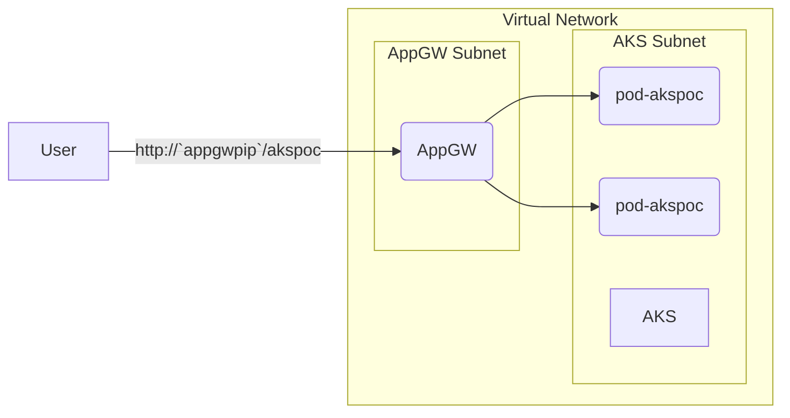
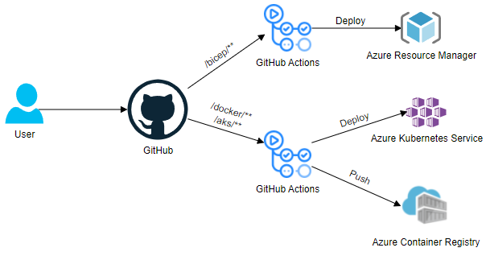
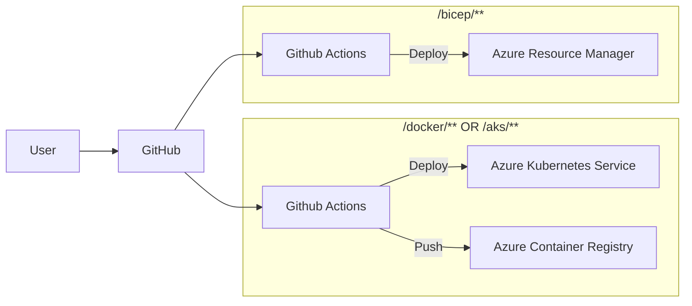

# Azure Kubernetes Service Proof of Concept
This is a simple deployment of Azure Kubernetes Service with ingress Application Gateway, with all required components. In addition, the deployment builds an image, pushes it to Azure Container Registry, and deploys it to Azure Kubernetes Service.

__This is <ins>NOT</ins> production-ready, and should only be used for testing purposes.__
## Instructions
### Prerequisites:
- Azure Container Registry already provisioned
- Service Principal or Token with push access to the Container Registry
- Azure Subscription with an Azure Resource Group provisioned
- Service Principal with Owner access to the Resource Group
### How-to: 
1. Create GitHub Action Secrets
    - `ACR_URI` ACR endpoint (e.g. `akspoc.azurecr.io`)
    - `ACR_USER` username if token auth or appid if SP auth
    - `ACR_PWD` password for token or SP
    - `SSH_PUBLIC` SSH Public key
    - `AZURE_SUBSCRIPTION` Azure Subscription ID
    - `AZURE_RG` Azure Resource Group name
    - `AZURE_CREDENTIALS` JSON representation of SP credentials for authentication to ARM:
        ```json
        {
            "clientId": "<GUID>",
            "clientSecret": "<GUID>",
            "subscriptionId": "<GUID>",
            "tenantId": "<GUID>"
        }
        ```
2. Change __line 49__ in `aks/deployment.yaml` with your ACR repo endpoint
3. _**(Optional)**_ Change the CIDR variables and configurations in the vnet resource in `bicep/main.bicep` if you want a larger address space, or don't want overlap with your existing network
4. Rename the `github` folder to `.github`
5. Trigger the Bicep GitHub Actions by doing a change in the `bicep` folder
    - Wait for workflow to complete  
7. Trigger the AKS GitHub Actions by doing a change in the `aks` or `docker` folder
    - Wait for workflow to complete
8. Browse to `http://<your-application-gateway-public-ip>/akspoc`

## High Level Architecture
Simplified architecture for the network flow and the GitHub Actions pipelines.
### Network


### Pipelines


## Structure
- `.github/workflows` contains the GitHub Actions deployment files
    - __aks-deploy.yaml__ triggers on push to the _docker_ or _aks_ folder and builds image, pushes to ACR, pulls and deploys to AKS
    - __bicep-deploy.yaml__ triggers on push to the _bicep_ folder and deploys Azure Bicep to the Resource Group in Azure
- `aks` contains the manifests for Azure Kubernetes Service
    - __deployment.yaml__ specifies the deployment, the service, and the appgw ingress for deployment of the image
- `bicep` contains the bicep configuration files
    - __main.bicep__ specifies all the main components and calls the _aks.bicep_ module for AKS creation
    - __aks.bicep__ specifies a module for Azure Kubernetes Service with required parameteres passed from _main.bicep_
- `docker` contains the files required to build the Docker image
    - __Dockerfile__ specifies the docker build specs
    - __hello.conf__ is an nginx config file used in the image
    - __index.html__ is the hello-world html static website
- `img` contains the images for the high level architecture in the README
